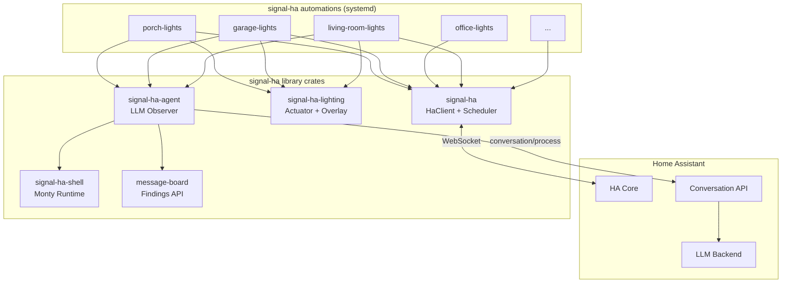

# Architecture

## System overview



## Design principles

### One process per automation

Each automation compiles to a single binary and runs as a systemd service.
There is no shared runtime, no plugin loader, and no event bus between
automations. If one crashes, the others are unaffected.

```
systemd
├── porch-lights.service      (signal-ha binary)
├── garage-lights.service     (signal-ha binary)
├── office-lights.service     (signal-ha binary)
├── living-room-lights.service
├── kitchen.service
├── message-board.service     (REST API)
└── house-agent.service       (overseer)
```

### WebSocket-first

All communication with Home Assistant uses the WebSocket API. State
subscriptions arrive as push events — no polling. Service calls and state
queries go over the same connection.

### Sun-aware scheduling

The `Scheduler` calculates sunrise and sunset for a given latitude/longitude
using the `sunrise` crate. Automations express their timing in terms of
solar events rather than fixed clock times.

### Embedded LLM agents

Each automation can optionally embed an agent (via `signal-ha-agent`) that
periodically reviews the automation's behaviour. The agent:

1. Receives a **SIGUSR1** signal (from a systemd timer)
2. Sends a prompt to the **HA Conversation API** (backed by any LLM)
3. Parses Python code blocks from the response
4. Executes them via the **Monty** pure-Rust Python interpreter
5. Posts findings to the **message-board**

Agents are read-only by default — they can query state and history but
cannot call services unless explicitly allowed.

### The house agent

A special **house-agent** acts as an overseer. It reads the message board,
triages findings from individual automation agents, and can escalate issues.

## Crate dependencies

```mermaid
graph LR
    CORE[signal-ha] --> LIGHTING[signal-ha-lighting]
    CORE --> AGENT[signal-ha-agent]
    AGENT --> SHELL[signal-ha-shell]
    CORE --> PY[signal-ha-py]
    AGENT --> BOARD[message-board]

    style CORE fill:#1a3a2a,stroke:#6b9a8a
    style LIGHTING fill:#1a2a3a,stroke:#5a7a9a
    style AGENT fill:#3a2a1a,stroke:#c97a5a
    style SHELL fill:#2a2a2a,stroke:#808080
    style PY fill:#2a2a2a,stroke:#808080
    style BOARD fill:#2a2a2a,stroke:#808080
```



| Arrow | Means |
|:------|:------|
| `signal-ha` → `signal-ha-lighting` | Lighting crate uses core types |
| `signal-ha` → `signal-ha-agent` | Agent uses HaClient for host calls |
| `signal-ha-agent` → `signal-ha-shell` | Agent executes Python via Monty |
| `signal-ha` → `signal-ha-py` | Python bindings wrap core types |
| `signal-ha-agent` → `message-board` | Agent posts findings via REST |
