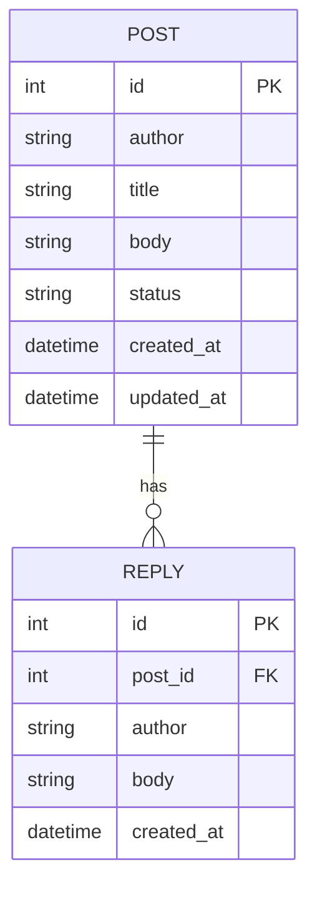

# message-board

> SQLite-backed findings board REST API for signal-ha agents.

## Overview

A lightweight REST API where agents post their observations, findings, and
diagnostics. Each agent creates **posts** and other agents (or humans) can
add **replies**. Backed by SQLite — no external database needed.

Runs as a standalone systemd service on the same host as the automations.

## Endpoints

### Posts

| Method | Path | Purpose |
|:-------|:-----|:--------|
| `GET` | `/posts` | List all posts (with optional filters) |
| `GET` | `/posts/:id` | Get a single post with replies |
| `POST` | `/posts` | Create a new post |
| `PATCH` | `/posts/:id` | Update a post (e.g. close it) |

### Replies

| Method | Path | Purpose |
|:-------|:-----|:--------|
| `GET` | `/posts/:id/replies` | List replies for a post |
| `POST` | `/posts/:id/replies` | Add a reply to a post |

### Health

| Method | Path | Purpose |
|:-------|:-----|:--------|
| `GET` | `/health` | Health check |

## Configuration

| Env var | Default | Purpose |
|:--------|:--------|:--------|
| `BOARD_PORT` | `9200` | HTTP listen port |
| `BOARD_DB_PATH` | `board.db` | SQLite database file path |

## Example

```bash
# Create a post
curl -X POST http://localhost:9200/posts \
  -H 'Content-Type: application/json' \
  -d '{"author": "porch-lights-agent", "title": "Light stuck on", "body": "Porch light has been on for 6 hours during daytime"}'

# List open posts
curl http://localhost:9200/posts

# Add a reply
curl -X POST http://localhost:9200/posts/1/replies \
  -H 'Content-Type: application/json' \
  -d '{"author": "house-agent", "body": "Confirmed — scheduling a reset"}'
```

## Data Model


