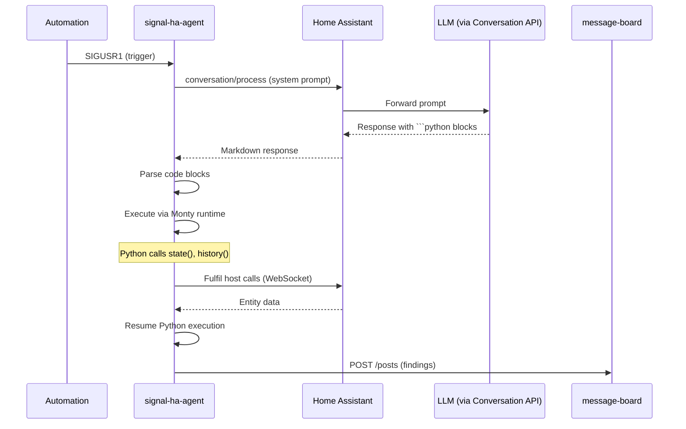

# signal-ha-agent

> Embedded LLM observation agent — uses the HA Conversation API to watch automations at runtime.

## Overview

Each signal-ha automation can embed an **agent** that periodically assesses
the automation's behaviour. The agent sends a system prompt and conversation
history to Home Assistant's Conversation API (backed by any LLM — local
Llama, OpenAI, Anthropic, etc.), parses fenced Python code blocks from the
response, executes them via the Monty runtime, and posts findings to the
message board.

The agent is **read-only by default** — it can query state and history but
cannot call services unless explicitly permitted.

## Architecture



## Usage

```rust
use signal_ha_agent::{AgentConfig, AgentHandle};

let config = AgentConfig {
    name: "porch-lights-agent".into(),
    role: "lighting observer".into(),
    description: "Monitors porch light automation behaviour".into(),
    ha_client: client.clone(),
    conversation_entity: "conversation.claude".into(),
    memory_path: "/var/lib/signal-ha/porch-lights/memory.json".into(),
    disallowed_calls: vec!["call_service".into()],
};

let handle = AgentHandle::spawn(config).await;
```

## API Reference

| Type | Purpose |
|:-----|:--------|
| `AgentConfig` | Configuration — name, role, HA client, conversation entity, memory path, disallowed calls |
| `AgentHandle` | Lifecycle handle returned by `spawn()` |

### Modules

| Module | Purpose |
|:-------|:--------|
| `conversation` | `conversation/process` WebSocket wrapper for LLM interaction |
| `parser` | Parses fenced `signal-deck` code blocks from LLM markdown |
| `engine` | Python execution engine wrapping signal-ha-shell's REPL |
| `ha_host` | HA-specific host call fulfillment — `state()`, `history()`, `call_service()` |
| `memory` | Persistent JSON memory across agent sessions |
| `session` | Agent session lifecycle management |

## Safety

!!! warning "Read-only by default"
    Agents can query entity state and history but **cannot call services**
    unless `call_service` is removed from `disallowed_calls`. This prevents
    an LLM from accidentally turning things on/off.

!!! info "Panic isolation"
    Panics in agent code are caught and logged — they never propagate to the
    host automation process.

## Dashboard Awareness

If an automation manages a Lovelace dashboard (via `DashboardSpec`), the
agent can be told about it by setting `dashboard_url_path` in `AgentConfig`.

When configured, the agent gains:

- **System prompt context** — told about the dashboard URL and its Agent view.
- **`list_dashboards()`** — list all Lovelace dashboards (url_path, title, icon).
- **`get_dashboard(url_path)`** — fetch full Lovelace config for a dashboard.
- **`update_agent_summary(markdown)`** — publish a markdown summary to the
  dashboard's Agent view. This writes to a sensor entity (e.g.
  `sensor.signal_porch_lights_agent_summary`) whose `markdown` attribute is
  rendered by a Jinja-templated markdown card on the dashboard.

### Agent View

Each automation dashboard has an **Agent** tab with:

- A markdown card rendering the agent's latest summary via Jinja template
- An entities card showing when the summary was last updated

Agents are instructed to call `update_agent_summary()` on their final turn
with a concise report of findings.

### Configuration

```rust
// In HaHost construction
let ha_host = HaHost::new(client, base_url, ws_url, token, status_url)
    .with_board(board_url, "porch-agent".into())
    .with_agent_summary_entity("sensor.signal_porch_lights_agent_summary".into());

// In AgentConfig
AgentConfig {
    dashboard_url_path: Some("signal-porch-lights".into()),
    // ...
};
```
